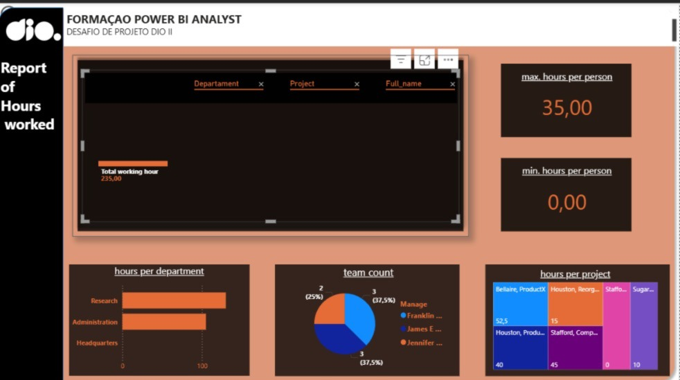
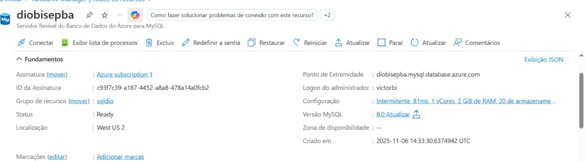

# 📊 Desafio de Projeto: Integração MySQL Azure + Power BI

Este projeto tem como objetivo integrar uma instância do MySQL na Azure com o Power BI, realizar transformações nos dados e construir um relatório analítico com base em regras de negócio e boas práticas de modelagem.

---

## 🧩 Etapas do Projeto

### 1. Descrição do Desafio
- Criação de instância MySQL na Azure
- Criação do banco de dados com base disponível no GitHub
- Integração com Power BI
- Transformações e modelagem dos dados

*Print da instância criada na Azure:*  

---

## 🔗 Conexão com o Banco de Dados  

### 2. Conexão via Cloud Shell

### 3. Regra de Firewall

### 4. Conexão via Workbench

## 🔄 Integração com Power BI

### 5. Conexão com MySQL no Power BI
- Fonte de dados configurada

---

## 🧼 Transformações Realizadas

### 6. Verificação de Cabeçalhos e Tipos

### 7. Tratamento de Valores Monetários  

### 8. Tratamento de Nulos  

Alguns colaboradores estavam em departamentos ainda sem funcionários ativos. Para evitar que esses registros aparecessem como vazios, atribuímos o próprio colaborador como gerente temporário. Isso mantém a estrutura do modelo e facilita futuras atualizações.

---

## 🔗 Mesclas e Modelagem

### 9. Mescla de Employee + Department  

Além da mescla entre `employee` e `department`, integrei também com `project` para obter o nome do projeto e com `works_on` para trazer as horas trabalhadas por colaborador. Mantive a coluna `salary`, pois pode ser útil em análises futuras.

### 10. Mescla de Employee + Gerente  

Para agrupar os colaboradores por gerente, foi necessário realizar uma mescla e aplicar um agrupamento. A intenção era exibir os nomes dos funcionários em linhas aninhadas por gerente, conforme exemplo proposto. No entanto, após diversas tentativas, identifiquei que a versão atual do Power BI não oferece suporte direto para esse tipo de visualização. Adotei alternativas para representar essa relação de forma clara e funcional.

### 11. Mescla de Nome + Sobrenome

### 12. Mescla de Departamento + Localização
- Criação de chave única

### 13. Justificativa: Mesclar vs Atribuir  
Utilizamos **mesclar** pois preserva a estrutura da tabela base e permite trazer colunas relacionadas sem sobrescrever os dados originais.

---

## 📊 Visualizações e Métricas

### 14. Cartões por Projeto e Departamento

### 15. Colaboradores por Gerente
- Visual de agrupamento  

### 16. Eliminação de Colunas
- Print das tabelas finais com colunas relevantes  

---

## ✅ Conclusão

Este projeto demonstra a capacidade de integrar dados em nuvem, aplicar transformações relevantes e construir um modelo analítico eficiente com Power BI.

---

📁 Arquivo do relatório:  
`C:\Users\vgagl\OneDrive\Área de Trabalho\repositorios\Relatorio Horas\Report hour.pptx`

📄 Local do README:  
`C:\Users\vgagl\OneDrive\Área de Trabalho\repositorios\Relatorio Horas\README.md`

---

## 👤 Autor

**Victor Biscaia**  
[LinkedIn](https://www.linkedin.com/in/victor-biscaia-097603371/)

---
